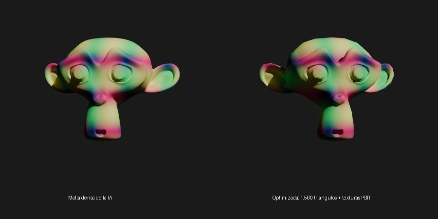

# AI 3D Generator — add-on de Blender

Genera modelos 3D desde **una imagen o una descripción de texto** con IA open source
**apta para uso comercial**, y usa Blender para que salgan listos para vender o usar en
producción: malla limpia y cerrada, tamaño real, polígonos controlados, UVs, texturas PBR,
LODs y exportación a los formatos de tiendas y motores. Licencias en [LICENSES.md](../LICENSES.md).

```
texto ─► SDXL / FLUX.1 schnell ─► imagen ─┐
                                          ├─► IS-Net (quita el fondo) ─► TripoSR ─► malla densa con color
foto o render propio ─────────────────────┘                                            │
                                                                                      ▼
   Blender: limpieza · tamaño real · decimado o quads · UVs · horneado color + normales · LODs
                                                                                      ▼
                                             GLB · FBX · OBJ · USDZ · STL + ficha de licencias .json
```

| Etapa | Modelo / herramienta | Licencia |
|---|---|---|
| Texto → imagen (opcional) | Stable Diffusion XL 1.0 o FLUX.1 [schnell] | OpenRAIL++-M / Apache-2.0 |
| Quitar fondo | IS-Net (DIS), ONNX | Apache-2.0 |
| Imagen → 3D | TripoSR (Tripo AI + Stability AI) | MIT (código y pesos) |
| Optimización | Blender: bmesh, Decimate, Remesh, QuadriFlow, Smart UV, Cycles bake | GPL (Blender) |



*Izquierda: malla densa con colores por vértice (lo que da la IA). Derecha: el mismo objeto
tras **Optimizar**: 1.500 triángulos con textura de color y mapa de normales horneados.*

Compatible con **Blender 4.2 LTS → 5.x**.

## Instalación

1. Genera el zip: `python scripts/build_extension.py ai_3d_generator`
   (crea `dist/ai_3d_generator-1.0.0.zip`).
2. Blender: **Edit › Preferences › Get Extensions › ▾ › Install from Disk…** y elige el zip.
   Acepta el permiso de **red** (descarga librerías y modelos).
3. En las preferencias del add-on:
   - *Variante de PyTorch*: Windows + NVIDIA → **CUDA 12.8**; Mac Apple Silicon o Linux →
     **Por defecto**; sin GPU → **Solo CPU**.
   - Pulsa **Instalar** en **PyTorch** y en **Imagen → 3D**. Para generar desde texto,
     instala también **Texto → imagen**.
4. Reinicia Blender si te lo pide.

Los modelos se descargan la primera vez que se usan: TripoSR 1,7 GB, IS-Net 170 MB,
SDXL ~7 GB, FLUX.1 schnell ~34 GB. Todo va a una carpeta privada del add-on.

| | Mínimo | Recomendado |
|---|---|---|
| Imagen → 3D | CPU (1–3 min por modelo) | GPU NVIDIA 6 GB+ o Apple Silicon (segundos) |
| Texto → imagen SDXL | GPU 8 GB (CPU: varios minutos) | GPU 12 GB+ |
| Texto → imagen FLUX | GPU 16 GB+ con 32 GB de RAM | GPU 24 GB |

## Uso

Vista 3D › **N** › pestaña **IA 3D**.

### 1 · Generar
- **Imagen**: elige una foto o render de **un solo objeto completo**, sin recortar, con
  luz suave. El fondo se quita solo (si el PNG ya tiene transparencia, se respeta).
- **Texto**: describe el objeto (*"lámpara de mesa de latón estilo art déco"*). Con
  *Estilo de asset 3D* se añade al prompt "objeto único, centrado, fondo blanco, luz de
  estudio", que es lo que mejor reconstruye la IA.
- Pulsa **Generar modelo 3D**. Con *Optimizar al terminar* activado, el resultado sale
  ya optimizado con los ajustes del paso 2. **ESC** cancela.

Ajustes avanzados: *Semilla* (repite un resultado), *Resolución de malla* (256 por
defecto; 384 da más detalle y usa mucha más memoria), *Umbral de densidad* (más bajo si
sale hueco o con agujeros, más alto si sale hinchado), *Quitar fragmentos* y *Suavizado*
(Taubin: quita el escalonado de marching cubes sin encoger el objeto).

### 2 · Optimizar (sirve para cualquier malla, no solo las generadas)
| Ajuste | Para qué |
|---|---|
| Tamaño real + Medida | Escala a metros reales (altura o lado mayor) y pone el origen en el suelo |
| Topología › Triángulos optimizados | Decimado que respeta la forma: juegos, web, AR, tiendas |
| Topología › Quads (QuadriFlow) | Retopología limpia para editar, esculpir o animar |
| Triángulos objetivo | Móvil/AR 5–20k · PC/consola 20–100k |
| UVs + PBR | Smart UV + horneado en Cycles del color y las normales de la malla densa |
| LODs | Copias con 1/2, 1/4… de polígonos, hijas del objeto |
| Conservar malla original | Guarda la densa en la colección oculta *AI 3D Originales* |

El panel **Control de calidad** muestra triángulos, medidas, si la malla es cerrada
(importante para impresión 3D y tiendas), UVs, texturas y si tiene ficha de origen.

### 3 · Exportar
Elige carpeta y formatos (GLB, FBX, OBJ, USDZ, STL). El objeto se exporta centrado en el
origen, cada LOD en su propio archivo, y con *Ficha de licencias* se escribe
`<nombre>_licencias.json` con los modelos de IA usados, sus licencias, prompt, semilla,
fecha e informe de calidad: tu prueba de procedencia si un cliente o una tienda la pide.

## Controlar el add-on desde Claude (MCP)

Con un servidor MCP para Blender (p. ej. **blender-mcp**) conectado a Claude en tu
ordenador, Claude puede usar esta API con la herramienta que ejecuta Python en Blender:

```python
import ai_3d_generator_api as ai3d
print(ai3d.help())
print(ai3d.generate(prompt="taza de cerámica esmaltada azul", real_size=0.1, name="Taza"))
print(ai3d.status())            # repetir hasta running == False
print(ai3d.inspect())           # triángulos, medidas, watertight, texturas
print(ai3d.export(directory=r"C:/assets", formats=("glb", "fbx")))
```

| Función | Qué hace |
|---|---|
| `generate(prompt=None, image=None, **ajustes)` | Texto o imagen → modelo; devuelve al instante |
| `optimize(object=None, **ajustes)` | Optimiza el objeto activo o el indicado |
| `export(object=None, directory=None, formats=("glb",))` | Exporta y escribe la ficha de licencias |
| `inspect(object=None)` · `status()` · `settings()` | Calidad, progreso y ajustes disponibles |
| `licenses()` · `cancel()` · `wait_hint()` | Licencias de los modelos, cancelar, cuánto esperar |

Ejemplo de petición en el chat: *"Genera un banco de parque de madera de 1,8 m de largo,
en quads, con LODs, y expórtalo en GLB y FBX"*.

## Consejos para que salgan bien

- **Una imagen, un objeto**: completo, centrado, vista 3/4 frontal ligeramente elevada,
  fondo liso, sin sombras duras. Objetos muy finos (cables, pelo, hojas sueltas) o
  transparentes (cristal) son los más difíciles para la IA.
- La parte trasera la **inventa** la IA: si importa, revísala o haz varias semillas.
- Para **tiendas de assets** (Fab, CGTrader, TurboSquid, Sketchfab): Triángulos
  optimizados, 20–50k, texturas 2K, GLB + FBX, y comprueba *Malla cerrada* en el panel de
  calidad.
- Para **impresión 3D**: Sin texturas, *Rellenar agujeros* activado, STL, tamaño real.
- Para **animar**: Quads (QuadriFlow) y luego rig normal de Blender.

## Uso comercial: lo que debes saber

- Los modelos que genera el add-on **son tuyos** y puedes venderlos: todos los modelos de
  IA usados permiten el uso comercial de sus resultados (ver [LICENSES.md](../LICENSES.md)).
- Si partes de **una imagen propia**, necesitas derechos sobre ella: no uses fotos de
  productos de otros, personajes con copyright ni marcas.
- SDXL (OpenRAIL++-M) prohíbe ciertos usos dañinos (desinformación, contenido ilegal…);
  no afecta a un uso normal de assets.
- Modelos populares **descartados** por su licencia: Hunyuan3D 2.x (excluye UE, Reino
  Unido y Corea del Sur), Stable Fast 3D / SPAR3D (licencia comunitaria con límite de
  ingresos), Zero123++ e InstantMesh (pesos no comerciales), RMBG-1.4 (no comercial),
  pipeline GLB de TRELLIS (nvdiffrast, no comercial).

## Problemas frecuentes

- **Sale hueco, roto o con agujeros** → baja el *Umbral de densidad* (15–20).
- **Sale hinchado o como una masa** → sube el umbral (30–40) o usa una imagen con el
  objeto más grande en el encuadre.
- **El fondo no se quita bien** → usa un PNG con transparencia o una foto con fondo liso.
- **Sin memoria (CUDA out of memory)** → *Resolución de malla* 192, desactiva *Mantener
  modelos en memoria* en Preferencias, o usa SDXL en vez de FLUX.
- **QuadriFlow falló** → el add-on usa decimado automáticamente; prueba otro *Detalle voxel*.

## Desarrollo

```
ai_3d_generator/
├── __init__.py, blender_manifest.toml
├── operators.py, ui.py, props.py, prefs.py   # Blender (hilo principal)
├── tools.py        # definición única de cada herramienta (UI y API)
├── api.py          # API para scripts y MCP (alias ai_3d_generator_api)
├── jobs.py         # hilo de trabajo + operador modal o temporizador
├── builders.py     # arrays → malla de Blender, ficha de origen
├── optimize.py     # limpieza, remesh, UVs, horneado PBR, LODs
├── export.py       # GLB/FBX/OBJ/USDZ/STL + ficha de licencias
├── deps.py         # pip a carpeta privada, numpy fijado al de Blender
├── core/           # sin bpy: IA, imagen, limpieza de malla (testeable fuera de Blender)
└── third_party/triposr/   # TripoSR (MIT) adaptado: sin omegaconf/transformers/torchmcubes
```

Tests (el de Blender usa el módulo `bpy` de PyPI, que requiere Python 3.11):
```bash
pip install numpy torch einops scikit-image onnxruntime pillow pytest bpy==4.2.0
pip install "transformers<5"   # opcional: compara el ViT con el de transformers
python -m pytest tests/test_ai3d_core.py tests/test_ai3d_blender.py -q
# con el quitafondos real:
AI3D_ISNET=/ruta/isnet-general-use.onnx python -m pytest tests/test_ai3d_blender.py -q
```
